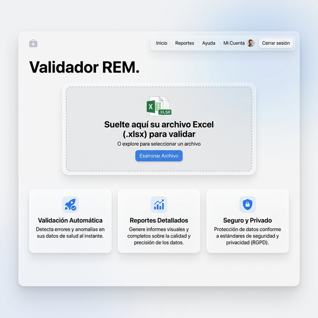
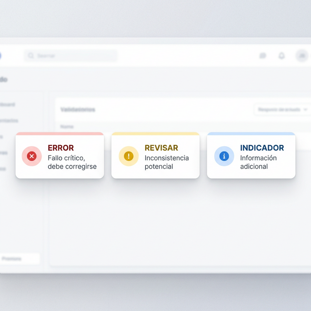
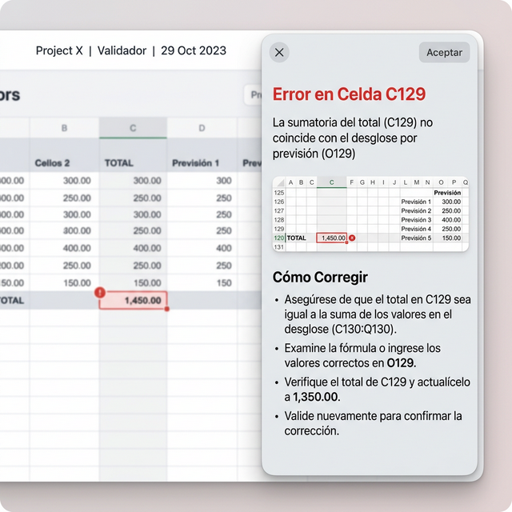
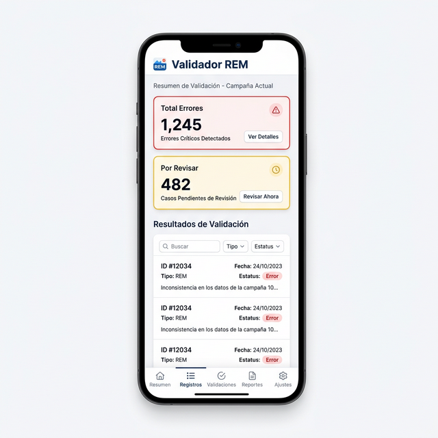
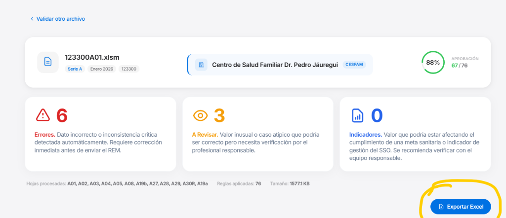

# 📘 Manual de Usuario: Validador REM DEIS SSO

Bienvenido al **Validador de Archivos REM del Servicio de Salud Osorno (SSO)**. Esta plataforma ha sido diseñada para revisar la estructura, consistencia y calidad de los datos reportados en sus planillas estadísticas mensuales antes de ser enviadas a la plataforma oficial.

---

## 1. Carga de Archivo y Validación Automática

El uso del sistema comienza siempre desde la pantalla principal, diseñada para ser completamente intuitiva y rápida, incluso en dispositivos móviles.

  

### Pasos para cargar un archivo:

1. **Revisa el nombre del archivo**: El sistema verifica su estructura al instante.  
   Su archivo siempre debe seguir el formato:  
   `CodEstab(6)Serie(1-2)Mes(2).xlsm`  
   *(Ejemplo: **123100A01.xlsm**)*
2. **Arrastra el Excel (XLSX o XLSM)** hacia el recuadro punteado al centro de la pantalla, o simplemente haz clic sobre él para abrir tu explorador de archivos.
3. El sistema **procesará automáticamente** las reglas de validación en tiempo real. 

> [!NOTE]
> **Privacidad Total**: El procesamiento ocurre 100% en su navegador. Sus datos clínicos **nunca** salen de su computador ni se envían a servidores externos.

---

## 2. Niveles de Alerta y Severidad

Para facilitar la priorización del trabajo, el sistema clasifica cada hallazgo en tres categorías visuales claras:

  

- 🔴 **ERROR**: Representa una falla estructural o lógica que **debe corregirse obligatoriamente**. Sin esta corrección, el DEIS rechazará la carga.
- 🟡 **REVISAR**: Indica una posible inconsistencia (ej. valores atípicos). Requiere que el equipo de estadística verifique si el dato es correcto según la realidad clínica.
- 🔵 **INDICADOR**: Sugerencias o advertencias menores que ayudan a mejorar la calidad del registro, pero no impiden el flujo.

---

## 3. Análisis de Hallazgos y Detalle de Errores

Una vez procesado el archivo, la **Tabla de Hallazgos** muestra todas las alertas. Para entender un error específico, puede ver su detalle expandido.

  

### Cómo leer el detalle de un error:

Cuando hace clic en **"Ver Detalle"**, se abre un panel lateral que le explica:
- **Ubicación Exacta**: La hoja y la celda (ej. A03, Celda C129).
- **Lógica de la Falla**: Una explicación humana de por qué falló la regla (ej. "El total no suma igual que sus partes").
- **Acción Recomendada**: Instrucciones directas de qué corregir en su archivo Excel original.

---

## 4. Uso en Terreno (Vista Móvil)

El validador es totalmente responsivo, lo que permite a los jefes de estadística o directivos revisar el estado de los archivos desde un smartphone o tablet durante reuniones o supervisiones en terreno.

  

---

## 5. Exportar Resultados y Siguientes Pasos

  

### Exportar Reporte a Excel
Use el botón verde **"Exportar a XLSX"** para descargar una lista maestra de errores. Esto es ideal para enviarlo por correo o WhatsApp al equipo encargado de corregir la digitación.

### Validar Otro Archivo
Cuando corrija su Excel, simplemente use el botón **"Validar otro archivo"** para volver a procesarlo y confirmar que los errores han desaparecido.

---
*Desarrollado por el Equipo de Ingeniería Senior - 2026*
