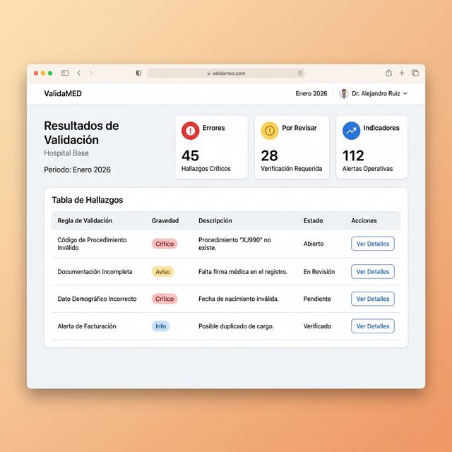

# 📘 Manual de Usuario: Validador REM DEIS SSO

Bienvenido al **Validador de Archivos REM del Servicio de Salud Osorno (SSO)**. Esta plataforma ha sido diseñada para revisar la estructura, consistencia y calidad de los datos reportados en sus planillas estadísticas mensuales antes de ser enviadas a la plataforma oficial.

---

## 1. Carga de Archivo y Validación Automática

El uso del sistema comienza siempre desde la pantalla principal, que está diseñada para ser completamente intuitiva.

  

### Pasos para cargar un archivo:

1. **Revisa el nombre del archivo**: El sistema verifica su estructura al instante.  
   Su archivo siempre debe seguir el formato:  
   `CodEstab(6)Serie(1-2)Mes(2).xlsm`  
   *(Ejemplo: **123100A01.xlsm**)*
2. **Arrastra el Excel (XLSX o XLSM)** hacia el recuadro punteado al centro de la pantalla, o simplemente haz clic sobre él para abrir tu explorador de archivos.
3. El sistema **procesará automáticamente** las reglas de validación en tiempo real. 
   *(Nota: Este procesamiento ocurre directamente en tu navegador; tus datos clínicos no son enviados a ningún servidor externo).*

---

## 2. Lectura del Tablero de Resultados

Una vez que el archivo es procesado, verás una pantalla detallada, separada en dos áreas principales: el **Resumen Superior** y la **Tabla de Hallazgos**.

  

### Resumen Superior (Dashboard)

Aquí puedes confirmar rápidamente si todo fue procesado de forma correcta:
- **Establecimiento y Serie:** Te confirmará a qué hospital o centro corresponden los datos, además del mes analizado.
- **Nivel de Severidad:** Identifica de forma inmediata dónde poner atención:
  - 🔴 **Error (Crítico):** Fallo obligatorio de corregir.
  - 🟡 **Revisar:** Posible inconsistencia (debe verificarse según criterio clínico/estadístico).
  - 🔵 **Indicador:** Información o advertencias menores que no detienen el flujo.

### Tabla de Hallazgos

En la parte inferior de los resultados verás el detalle de todas las alertas levantadas:
1. En cada fila se detalla la **Hoja REM** (ej. A01), la **Regla incumplida** y una **Descripción** de lo que ocurre.
2. Cada fila cuenta con un botón **"Ver Detalle"** al lado derecho. 
3. Al hacer clic, se abrirá un panel lateral derecho explicándote con exactitud **qué celda del Excel** falló y una recomendación para solucionarlo.

---

## 3. Exportar Resultados y Siguientes Pasos

Una de las utilidades más prácticas del Validador es la posibilidad de descargar los errores detectados para trabajarlos cómodamente.

  

### Exportar Reporte a Excel

- Usa el botón verde **"Exportar a XLSX"** ubicado arriba de la tabla.
- El sistema descargará un archivo Excel con todos los hallazgos en formato de lista.
- Puedes enviar este documento al equipo encargado de las correcciones de estadística, facilitándoles la ubicación exacta de las celdas mal digitadas.

### Validar Otro Archivo

- Cuando hayas corregido el archivo original, o si deseas probar otra serie estadística (por ejemplo, pasar de la serie *A* a la *B*), haz clic en el botón azul suave **"Validar otro archivo"** ubicado en la esquina superior derecha. 
- Volverás inmediatamente a la pantalla principal sin perder velocidad ni sobrecargar tu navegador.

---
*Si presentas problemas continuos con las validaciones, asegúrate de estar utilizando un archivo correspondiente a la última versión del año estadístico en curso o contacta al equipo de DEIS SSO.*
