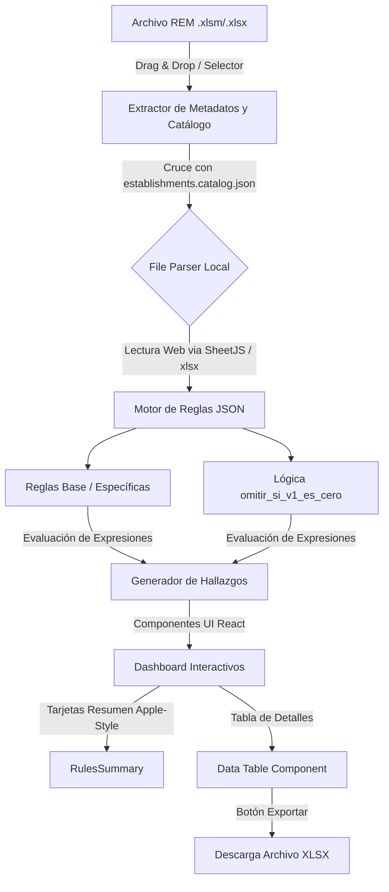

# Flujo de Datos del Sistema - Validador DEIS SSO (Actual)

Este documento describe cómo se mueven y transforman los datos dentro de la aplicación actual, basada en un entorno web SPA (React + Vite), desde la carga local del archivo REM en el navegador hasta la generación del reporte de hallazgos interactivo.

## Vista General del Arquitectura

## 1. Entrada de Datos (Client-Side Input)
El flujo comienza completamente del lado del cliente sin enviar datos a un servidor backend (privacidad garantizada).
- **Origen:** El usuario arrastra o selecciona un archivo Excel (Series A, P, D, BM) generado por los establecimientos.
- **Detección Dinámica:** El componente principal extrae metadatos del nombre del archivo:
  - Código del Establecimiento (DEIS).
  - Serie REM.
  - Año y mes.
- **Validación Inicial:** Se cruza el código de establecimiento detectado con el catálogo oficial (`establishments.catalog.json`) para verificar su existencia y tipo (Hospital, Posta, CESFAM, SAMU, etc.).

## 2. Extracción y Lectura Local
- **Tecnología:** Librería `xlsx` (SheetJS) corriendo directamente en el navegador de forma asíncrona (A web service/worker puede involucrarse para evitar que la UI se congele con excels grandes).
- **Proceso:** 
  1. Se carga el archivo en memoria usando un FileReader.
  2. Se identifican las pestañas relevantes según los metadatos de la serie REM.
  3. Se extrae el contenido celdas en objetos o matrices JSON para una fácil manipulación en JavaScript/TypeScript.

## 3. Motor de Validación (Rule Engine en TypeScript)
Las reglas estan separadas de la logica y centralizadas en `data/reglas_finales.json`, que actua como unica fuente de verdad.
- **Filtros por Tipo de Establecimiento (`aplicar_a_tipo` y `establecimientos_excluidos`):** Las reglas que se cargan dependen directamente del tipo detectado en el nombre del archivo cruzado con el catálogo.
- **Tipos de Transformación y Evaluación:**
  - **Identificación:** Se parsean referencias como `"A02!D53"`.
  - **Comparación Cruzada:** Contraste de valores usando operandos como `==`, `>=`, `<=`, `!=`.
  - **Reglas de Omisión Condicionales:** Se evalúan *flags* modernos como `omitir_si_ambos_cero`, `omitir_si_v1_es_cero` o `omitir_si_v2_es_cero` para prevenir falsos positivos matemáticos (ej: no validar tasas vacías comparadas con valores vacíos).

## 4. Salida de Datos (Output) e Interfaz
La información procesada fluye por el árbol de componentes React, garantizando que todo sea dinámico:

### 4.1. Dashboard y Resumen UI
- Integración de tarjetas visuales de alto nivel (Componente `RulesSummary.tsx`) priorizando un enfoque minimalista y de rápida lectura analítica.
- Muestra métricas circulares de "Aprobación".
- Renderiza contadores segmentados para cada grado de severidad basándose en el enum `Severity`: **Errores (Rojo)**, **A Revisar (Naranja)** y **Indicadores (Azul)**.

### 4.2. Grilla de Hallazgos
- Tabla React interactiva en vez de un clásico `DataGridView`. 
- Permite ordenar y filtrar los hallazgos. Se pinta el componente visual con íconos o alertas que indican el ID de la validación, la fila impactada y la justificación.

### 4.3. Exportación Modular
- El botón de exportar delega la función a un generador de excels local (`xlsx-js-style` u homólogos).
- Convierte el arreglo final de anomalías mapeado en JS a formato binario para entregarlos directamente al usuario como archivo descargable con todo el styling semántico aplicado a sus celdas (rojo para error, etc).

## 5. Almacenamiento, Tema y Persistencia
- **Sin base de datos backend**. El validador opera en arquitectura front-end PWA.
- La persistencia (como selección de Modo Claro/Oscuro) se enruta a través de `Cookies` o `localStorage`.
- Los resultados de validaciones se pierden lógicamente al recargar el navegador (modelo efímero por seguridad de los datos sensibles).
