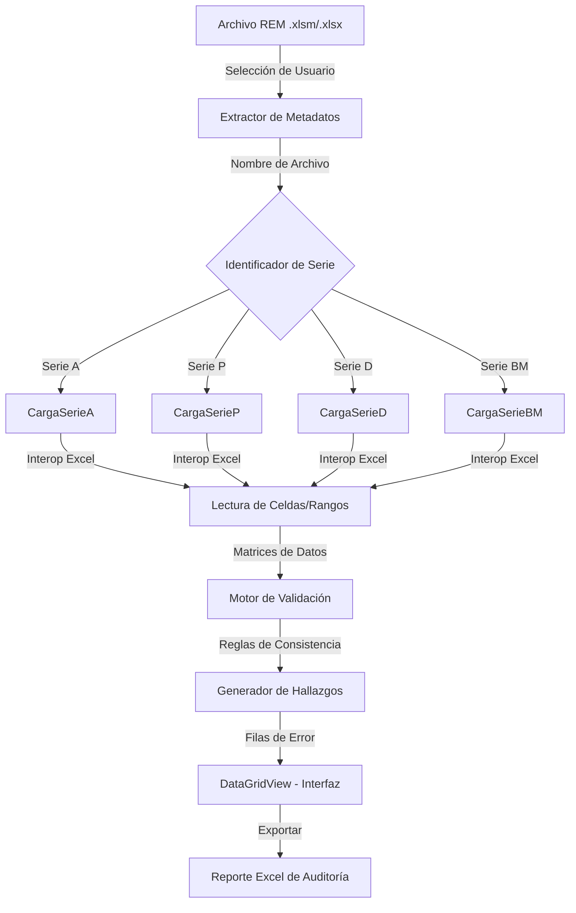

# Flujo de Datos del Sistema - Validador DEIS SSO

Este documento describe cómo se mueven y transforman los datos dentro de la aplicación, desde la entrada del archivo REM hasta la generación del reporte de hallazgos.

## Vista General del Flujo

## 1. Entrada de Datos (Input)
El flujo comienza con la selección manual de un archivo por parte del usuario mediante `OpenFileDialog1`.
- **Origen:** Archivos Excel generados por sistemas locales de salud o digitados manualmente.
- **Detección Dinámica:** El sistema utiliza `Path.GetFileNameWithoutExtension` y funciones de cadena (`Mid`, `Len`) para parsear el nombre:
  - **Dígitos 1-6:** Código del Establecimiento (DEIS).
  - **Dígitos 7-8/9:** Identificador de la Serie REM (A, P, D, BM).
  - **Variables Extraídas:** `NombreArchivo`, `ValidaAno`, `ValidaMes`, `ValidaCodigo`.

## 2. Extracción y Carga (Loading)
Una vez identificada la serie, el sistema activa el procedimiento correspondiente (ej: `CargaSerieA`).
- **Tecnología:** Microsoft Office Interop Excel.
- **Proceso:** 
  1. Se abre el libro (`xlLibro`).
  2. Se accede a pestañas específicas (ej: "A01", "A02", "D04").
  3. Se cargan rangos de celdas en matrices locales (`C()`, `D()`, `E()`, etc.) para minimizar el tiempo de acceso al archivo abierto.

## 3. Procesamiento y Validación (Logic)
Aquí ocurre la transformación de datos crudos en hallazgos de auditoría.
- **Tipos de Transformación:**
  - **Agregación:** Suma de celdas para verificar totales (ej: `O(31) + P(31) + Q(31)...`).
  - **Comparación Cruzada:** Contraste de valores entre diferentes procedimientos (ej: Hallazgos en A01 comparados con totales en A02).
  - **Evaluación de Alertas:** Lógica condicional (`Select Case`) para categorizar el valor:
    - Valor != 0 en celda prohibida -> **[REVISAR]**
    - Suma A < Suma B (donde A es subconjunto de B) -> **[ERROR]**

## 4. Salida de Datos (Output)
La información procesada fluye hacia dos destinos principales:

### 4.1. Interfaz de Usuario (UI)
- Los hallazgos se insertan directamente en `DataGridView1`.
- Cada fila contiene: Código REM, Sección, Identificador de Validación, Severidad, Descripción y el Valor detectado.

### 4.2. Reporte de Auditoría (Export)
- Al presionar "Exportar", se crea una nueva instancia de Excel (`xlExcel`).
- Los datos de la grilla se transfieren fila por fila.
- **Formateo Condicional:** Se aplica color de fuente según la severidad (`RGB(255, 0, 0)` para errores) para resaltar los puntos críticos ante el revisor humano.

## 5. Almacenamiento y Persistencia
- La aplicación **no cuenta con base de datos local**. 
- La persistencia de los hallazgos es efímera (solo durante la ejecución) hasta que se exporta el archivo Excel de salida.
